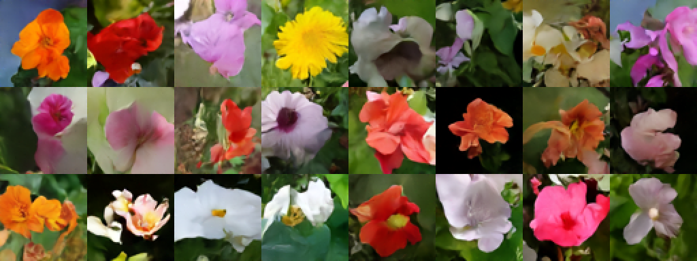
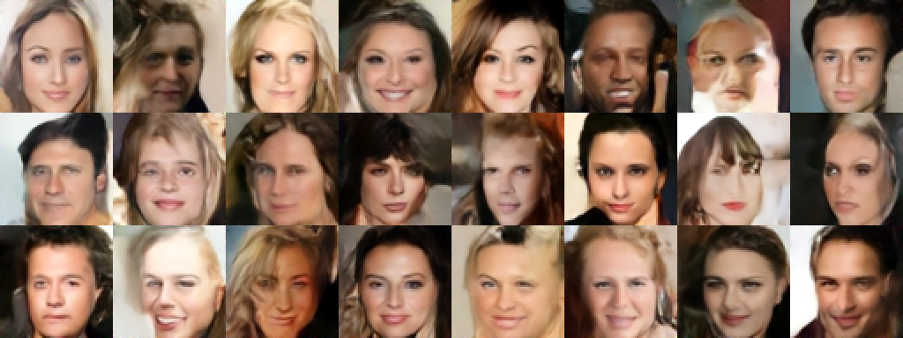
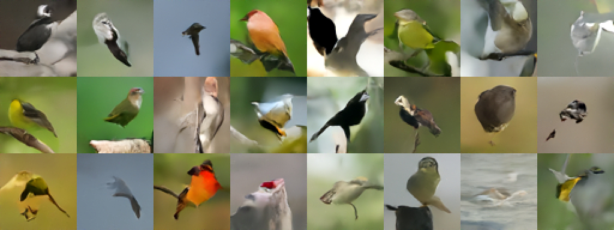
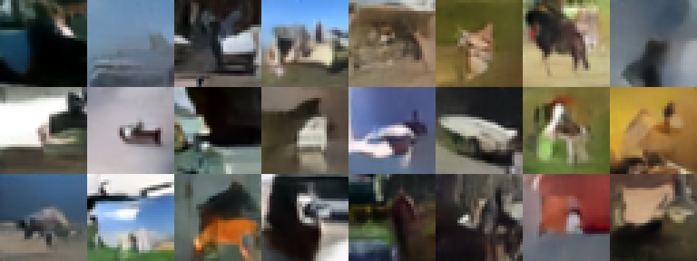

# Clear Diffusion Keras: Modular and Readable Denoising Diffusion Models

This repository contains:
* An implementation of [Denoising Diffusion Implicit Models (DDIM)](https://arxiv.org/abs/2010.02502) with continuous time. All variables are properly named and the code is densely commented. It was used for ablations and hyperparameter optimization for the corresponding [Keras code example](https://keras.io/examples/generative/).
* Stochastic sampling, with which the model becomes a [Denoising Diffusion Probabilistic Model (DDPM)](https://arxiv.org/abs/2006.11239). `Stochasticity` corresponds to *eta* in the DDIM paper, while the `variance_preserving` flag selects between the two sampling versions ([Equation 16 in DDIM](https://arxiv.org/abs/2010.02502)).
* [General second-order sampling](https://en.wikipedia.org/wiki/List_of_Runge%E2%80%93Kutta_methods#Generic_second-order_method), as proposed in [Elucidating the Design Space of Diffusion-Based Generative Models](https://arxiv.org/abs/2206.00364), controlled with `second_order_alpha`.
* [Multistep sampling](https://en.wikipedia.org/wiki/Linear_multistep_method#Adams%E2%80%93Bashforth_methods), similarly to [Pseudo Numerical Methods for Diffusion Models on Manifolds (PNDM)](https://arxiv.org/abs/2202.09778), supporting `num_multisteps` between 1 and 5. Note that in the initial steps I use lower order multistep sampling, instead of other higher-order methods, for simplicity.
* 7 diffusion schedules, selected with `schedule_type`.
* 3 network parametrizations, selected with `prediction_type`. It can predict the unscaled random gaussian noise, the original image, or even the [diffusion velocity (Section 4)](https://arxiv.org/abs/2202.00512).
* 3 loss weightings, selected with `loss_type`, which correspond minimising the error of the predicted unscaled noise, predicted original image, or the [diffusion velocity](https://arxiv.org/abs/2202.00512).
* An implementation of [Kernel Inception Distance (KID)](https://arxiv.org/abs/1801.01401), which is a generative performance metric with a simple unbiased estimator, that is more suitable for limited amounts of images, and is also computationally cheaper to measure compared to the [Frechet Inception Distance (FID)](https://arxiv.org/abs/1706.08500). Implementation details include (all being easy to tweak):
    * The Inceptionv3 network's pretrained weights are loaded from [Keras applications](https://keras.io/api/applications/inceptionv3/).
    * For computational efficiency, the images are evaluated at the minimal possible resolution (75x75 instead of 299x299), therefore the exact values might not be comparable with other implementations.
    * For computational efficiency, it is measured only on the validation splits of the datasets.
    * For computational efficiency, it is measured on images generated with only 5 diffusion steps.

### How do diffusion models work?

Diffusion models are trained to denoise noisy images, and can
generate images by iteratively denoising pure noise.

## Generation quality on different datasets:

KID results (the lower the better):

Dataset / Loss | mean absolute error (MAE) | mean squared error (MSE)
--- | --- | ---
**Oxford Flowers** | 0.259 | 0.399
**CelebA** | 0.148 | 0.104
**Caltech Birds** | 1.382 | 1.697
**CIFAR-10** | 0.217 | 0.175

Same hyperparameters, tuned on Oxford Flowers.

All visualizations below were generated using:
* 200 diffusion steps
* DDPM sampling with large variance (stochasticity = 1.0, variance_preserving = False)
* all other parameters left on default

## Oxford Flowers 102

* 6500 training images (80% of every split)
* 64x64 resolution, center cropped

## CelebFaces Attributes (CelebA)

* 160.000 training images
* 64x64 resolution, center cropped

## Caltech Birds 2011 (CUB-200)

* 6000 training images
* 64x64 resolution, cropped on bounding boxes

## CIFAR-10

* 50.000 training images
* 32x32 resolution

